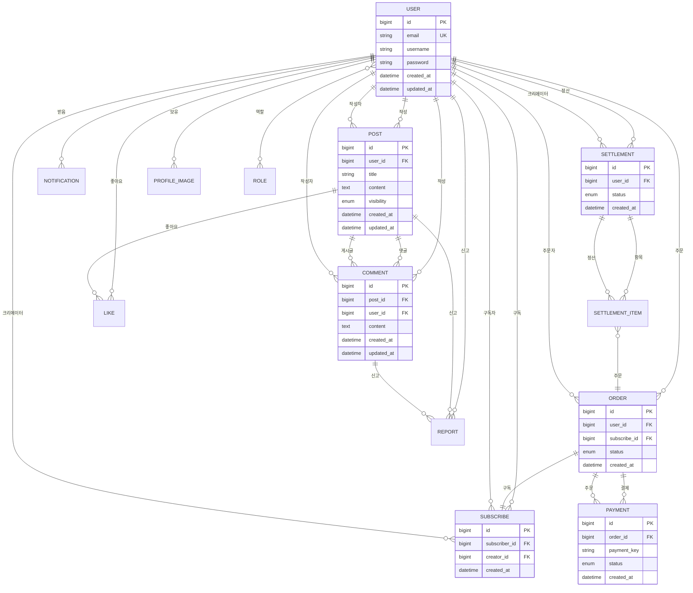

# 시스템 아키텍처 문서

## 프로젝트 개요
SNS-Service는 크리에이터 구독 기반 소셜 네트워크 서비스입니다.
- **Backend**: Spring Boot 3.5.9 (Java 21)
- **Frontend**: Next.js 16.1.1 (React 19, TypeScript)
- **Database**: MySQL 8.0
- **Cache**: Redis 7
- **Infrastructure**: Docker Compose

---

## 전체 시스템 아키텍처

```mermaid
graph TB
    subgraph "Client Layer"
        Browser[웹 브라우저]
    end
    
    subgraph "Frontend Layer"
        NextJS[Next.js 16.1.1<br/>React 19 + TypeScript]
        Pages[App Router Pages]
        Components[React Components]
        API[API Client<br/>Axios]
    end
    
    subgraph "Backend Layer"
        SpringBoot[Spring Boot 3.5.9<br/>Java 21]
        
        subgraph "Security"
            JWT[JWT Authentication]
            Security[Spring Security]
        end
        
        subgraph "Controllers"
            AuthCtrl[AuthController]
            UserCtrl[UserController]
            PostCtrl[PostController]
            CommentCtrl[CommentController]
            LikeCtrl[LikeController]
            SubscribeCtrl[SubscribeController]
            OrderCtrl[OrderController]
            PaymentCtrl[PaymentController]
            SettlementCtrl[SettlementController]
            NotificationCtrl[NotificationController]
            ReportCtrl[ReportController]
            AdminCtrl[AdminController]
            MailCtrl[MailController]
        end
        
        subgraph "Services"
            AuthSvc[AuthService]
            UserSvc[UserService]
            PostSvc[PostService]
            CommentSvc[CommentService]
            LikeSvc[LikeService]
            SubscribeSvc[SubscribeService]
            OrderSvc[OrderService]
            PaymentSvc[PaymentService]
            SettlementSvc[SettlementService]
            NotificationSvc[NotificationService]
            ReportSvc[ReportService]
            MailSvc[MailService]
        end
        
        subgraph "Repositories"
            UserRepo[UserRepository]
            PostRepo[PostRepository]
            CommentRepo[CommentRepository]
            LikeRepo[LikeRepository]
            SubscribeRepo[SubscribeRepository]
            OrderRepo[OrderRepository]
            PaymentRepo[PaymentRepository]
            SettlementRepo[SettlementRepository]
            NotificationRepo[NotificationRepository]
            ReportRepo[ReportRepository]
        end
    end
    
    subgraph "Data Layer"
        MySQL[(MySQL 8.0<br/>데이터베이스)]
        Redis[(Redis 7<br/>캐시/세션)]
    end
    
    subgraph "External Services"
        MailServer[SMTP<br/>이메일 서버]
        TossPayment[토스페이먼츠<br/>결제 API]
    end
    
    Browser -->|HTTP/HTTPS| NextJS
    NextJS --> Pages
    Pages --> Components
    Components --> API
    API -->|REST API| SpringBoot
    
    SpringBoot --> Security
    Security --> JWT
    
    SpringBoot --> AuthCtrl
    SpringBoot --> UserCtrl
    SpringBoot --> PostCtrl
    SpringBoot --> CommentCtrl
    SpringBoot --> LikeCtrl
    SpringBoot --> SubscribeCtrl
    SpringBoot --> OrderCtrl
    SpringBoot --> PaymentCtrl
    SpringBoot --> SettlementCtrl
    SpringBoot --> NotificationCtrl
    SpringBoot --> ReportCtrl
    SpringBoot --> AdminCtrl
    SpringBoot --> MailCtrl
    
    AuthCtrl --> AuthSvc
    UserCtrl --> UserSvc
    PostCtrl --> PostSvc
    CommentCtrl --> CommentSvc
    LikeCtrl --> LikeSvc
    SubscribeCtrl --> SubscribeSvc
    OrderCtrl --> OrderSvc
    PaymentCtrl --> PaymentSvc
    SettlementCtrl --> SettlementSvc
    NotificationCtrl --> NotificationSvc
    ReportCtrl --> ReportSvc
    MailCtrl --> MailSvc
    
    AuthSvc --> UserRepo
    UserSvc --> UserRepo
    PostSvc --> PostRepo
    CommentSvc --> CommentRepo
    LikeSvc --> LikeRepo
    SubscribeSvc --> SubscribeRepo
    OrderSvc --> OrderRepo
    PaymentSvc --> PaymentRepo
    SettlementSvc --> SettlementRepo
    NotificationSvc --> NotificationRepo
    ReportSvc --> ReportRepo
    MailSvc --> MailServer
    
    UserRepo --> MySQL
    PostRepo --> MySQL
    CommentRepo --> MySQL
    LikeRepo --> MySQL
    SubscribeRepo --> MySQL
    OrderRepo --> MySQL
    PaymentRepo --> MySQL
    SettlementRepo --> MySQL
    NotificationRepo --> MySQL
    ReportRepo --> MySQL
    
    SpringBoot --> Redis
    PaymentSvc --> TossPayment
    
    style Browser fill:#e1f5ff
    style NextJS fill:#0070f3,color:#fff
    style SpringBoot fill:#6db33f,color:#fff
    style MySQL fill:#4479a1,color:#fff
    style Redis fill:#dc382d,color:#fff
    style TossPayment fill:#ff6b6b,color:#fff
```

---

## 백엔드 모듈 구조


---

## 프론트엔드 구조

```mermaid
graph TB
    subgraph "Next.js App Router"
        RootLayout[layout.tsx<br/>루트 레이아웃]
        
        subgraph "Public Pages"
            Home[page.tsx<br/>홈/피드]
            Login[login/page.tsx<br/>로그인]
            Signup[signup/page.tsx<br/>회원가입]
            Creators[creators/[creatorId]/page.tsx<br/>크리에이터 상세]
            Posts[posts/[postId]/page.tsx<br/>게시글 상세]
        end
        
        subgraph "User Pages"
            Me[me/page.tsx<br/>마이페이지]
            Account[me/account/page.tsx<br/>계정 관리]
            MyPosts[me/posts/page.tsx<br/>내 게시글]
            MyComments[me/comments/page.tsx<br/>내 댓글]
            Orders[me/orders/page.tsx<br/>주문 내역]
            Subscriptions[me/subscriptions/page.tsx<br/>구독 목록]
            Settlements[me/settlements/page.tsx<br/>정산 내역]
            ProfileImage[me/profile-image/page.tsx<br/>프로필 이미지]
            CreatorApp[me/creator-application/page.tsx<br/>크리에이터 신청]
        end
        
        subgraph "Creator Pages"
            NewPost[creator/posts/new/page.tsx<br/>게시글 작성]
        end
        
        subgraph "Admin Pages"
            Admin[admin/page.tsx<br/>관리자 대시보드]
            Users[admin/users/page.tsx<br/>사용자 관리]
            Creators[admin/creators/page.tsx<br/>크리에이터 관리]
            CreatorApps[admin/creator-applications/page.tsx<br/>크리에이터 신청 관리]
            Reports[admin/reports/page.tsx<br/>신고 관리]
            Announcements[admin/announcements/page.tsx<br/>공지사항]
        end
        
        subgraph "Common Pages"
            Notifications[notifications/page.tsx<br/>알림]
            PaySuccess[pay/success/page.tsx<br/>결제 성공]
            PayFail[pay/fail/page.tsx<br/>결제 실패]
        end
    end
    
    subgraph "Components"
        Common[common/<br/>공통 컴포넌트]
        Comment[comment/<br/>댓글 컴포넌트]
        Notification[notification/<br/>알림 컴포넌트]
        Report[report/<br/>신고 컴포넌트]
    end
    
    subgraph "API Layer"
        AuthAPI[authApi.ts]
        UserAPI[userApi.ts]
        PostAPI[postApi.ts]
        CommentAPI[commentApi.ts]
        LikeAPI[likeApi.ts]
        SubscribeAPI[subscribeApi.ts]
        OrderAPI[orderApi.ts]
        PaymentAPI[paymentApi.ts]
        SettlementAPI[settlementApi.ts]
        NotificationAPI[notificationApi.ts]
        ReportAPI[reportApi.ts]
        AdminAPI[adminApi.ts]
        EmailAPI[emailApi.ts]
        ProfileImageAPI[profileImageApi.ts]
    end
    
    subgraph "Core"
        Axios[axios.ts<br/>HTTP 클라이언트<br/>토큰 갱신 로직]
        Middleware[middleware.ts<br/>인증 미들웨어]
        Hooks[hooks/useAuth.ts<br/>인증 훅]
        Types[types/<br/>TypeScript 타입]
    end
    
    RootLayout --> Home
    RootLayout --> Login
    RootLayout --> Signup
    RootLayout --> Creators
    RootLayout --> Posts
    RootLayout --> Me
    RootLayout --> Admin
    RootLayout --> Notifications
    
    Home --> Components
    Me --> Components
    Admin --> Components
    
    Components --> API
    Pages --> API
    
    API --> Axios
    Axios --> Backend[Backend API]
    
    Middleware --> Axios
    Hooks --> AuthAPI
    
    style RootLayout fill:#0070f3,color:#fff
    style Axios fill:#4ecdc4,color:#fff
    style Backend fill:#6db33f,color:#fff
```

---

## 인증 및 보안 아키텍처


---

## 데이터베이스 관계도 (주요 엔티티)



---

## 배포 아키텍처


---

## 주요 기술 스택

### Backend
- **Framework**: Spring Boot 3.5.9
- **Language**: Java 21
- **Build Tool**: Gradle
- **Security**: Spring Security + JWT
- **ORM**: Spring Data JPA
- **Database**: MySQL 8.0
- **Cache**: Redis 7
- **Email**: Spring Mail
- **Batch**: Spring Batch
- **Validation**: Spring Validation

### Frontend
- **Framework**: Next.js 16.1.1
- **Language**: TypeScript
- **UI Library**: React 19.2.3
- **Styling**: Tailwind CSS 4
- **HTTP Client**: Axios 1.7.9
- **Routing**: App Router

### Infrastructure
- **Containerization**: Docker
- **Orchestration**: Docker Compose
- **Database**: MySQL 8.0
- **Cache**: Redis 7

---

## 주요 기능 모듈

1. **인증/인가 (Auth)**: JWT 기반 인증, 역할 기반 접근 제어
2. **사용자 관리 (User)**: 회원가입, 프로필 관리, 크리에이터 신청
3. **게시글 (Post)**: 게시글 작성, 조회, 공개/구독자 전용 설정
4. **댓글 (Comment)**: 댓글 작성, 수정, 삭제
5. **좋아요 (Like)**: 게시글 좋아요 기능
6. **구독 (Subscribe)**: 크리에이터 구독 기능
7. **주문/결제 (Order/Payment)**: 구독 주문 및 토스페이먼츠 결제 연동
8. **정산 (Settlement)**: 크리에이터 정산 관리
9. **알림 (Notification)**: 실시간 알림 기능
10. **신고 (Report)**: 게시글/댓글 신고 기능
11. **이메일 (Email)**: 이메일 인증 및 알림
12. **관리자 (Admin)**: 관리자 대시보드 및 관리 기능


