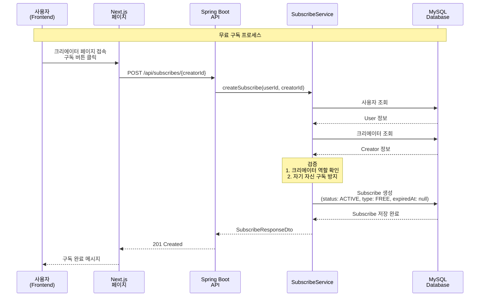
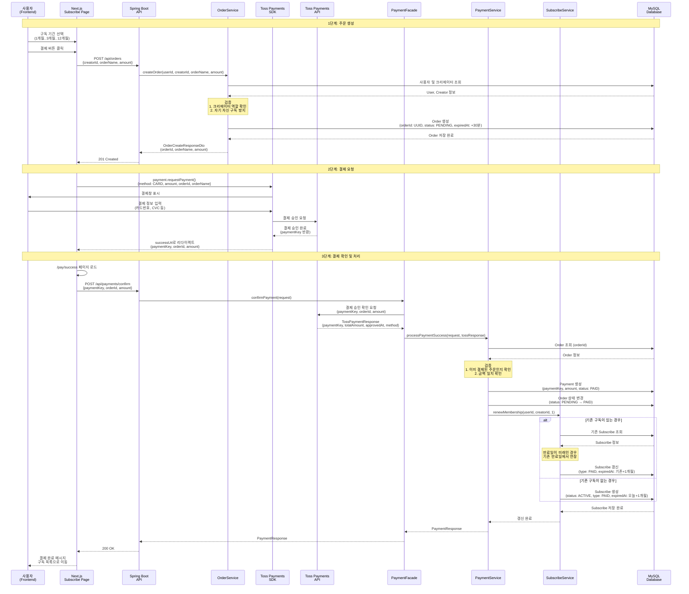
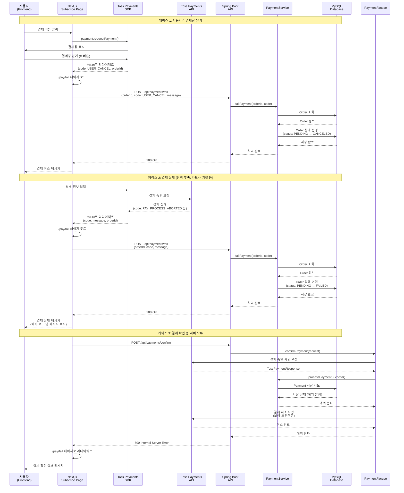
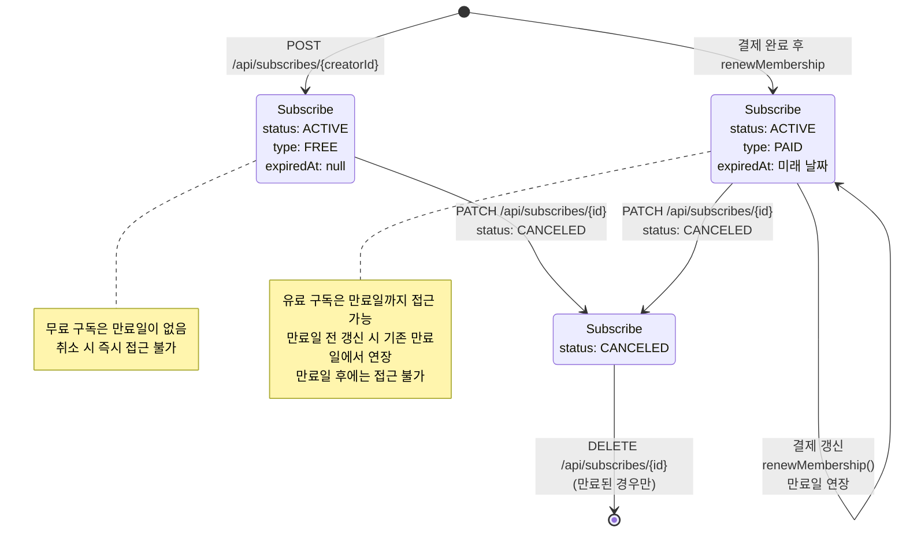
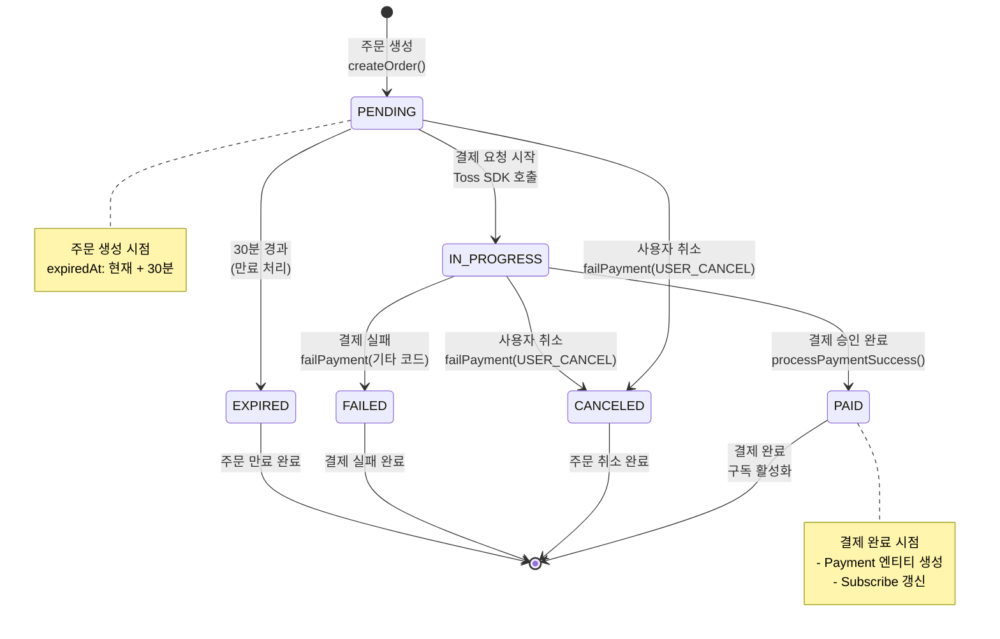
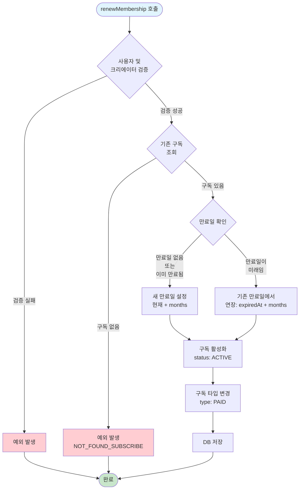
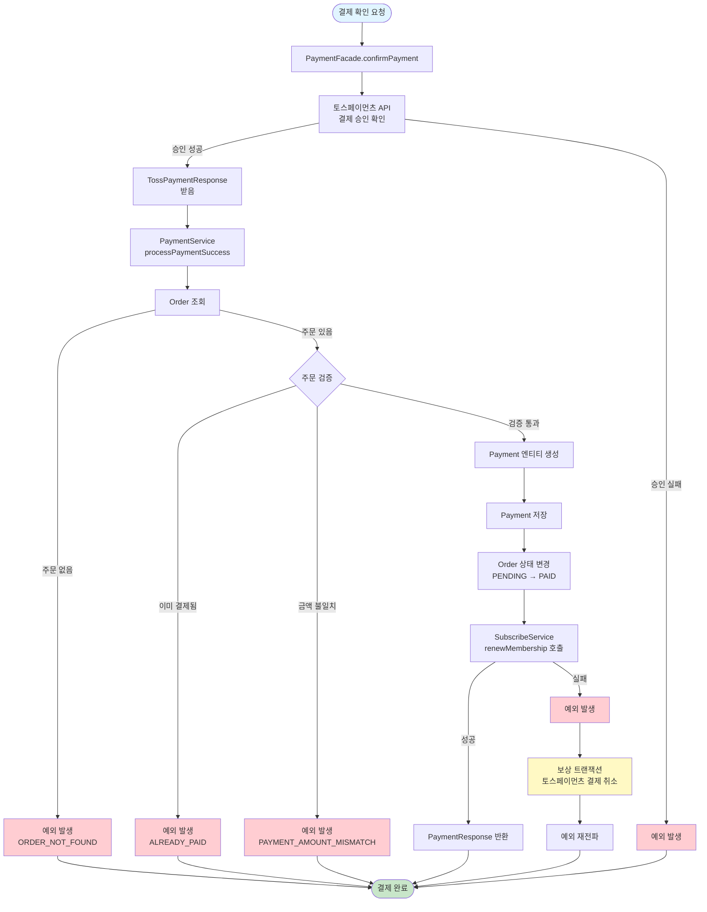

# 결제 및 구독 플로우 문서

## 개요
이 문서는 SNS-Service의 결제 및 구독 시스템의 전체 플로우를 설명합니다.
- **무료 구독**: 사용자가 크리에이터를 무료로 구독
- **유료 구독**: 결제를 통한 멤버십 구독
- **구독 갱신**: 기존 구독 기간 연장
- **결제 처리**: 토스페이먼츠 연동을 통한 결제 승인 및 실패 처리

---

## 무료 구독 플로우



---

## 유료 구독(결제) 플로우 - 성공 케이스



---

## 유료 구독(결제) 플로우 - 실패 케이스



---

## 구독 상태 관리 플로우



---

## 주문 상태 전이도



---

## 구독 갱신 로직 상세



---

## 결제 승인 프로세스 상세



---

## 데이터 모델 관계도

```mermaid
erDiagram
    USER ||--o{ SUBSCRIBE : "구독"
    USER ||--o{ ORDER : "주문"
    USER ||--o{ PAYMENT : "결제"
    
    SUBSCRIBE {
        bigint id PK
        bigint user_id FK
        bigint creator_id FK
        enum status "ACTIVE, CANCELED"
        enum type "FREE, PAID"
        date expiredAt "null이면 무료 구독"
        datetime created_at
    }
    
    ORDER {
        bigint id PK
        string orderId UK "UUID 기반"
        bigint user_id FK
        bigint creator_id FK
        string orderName
        bigint amount
        enum status "PENDING, IN_PROGRESS, PAID, CANCELED, FAILED, EXPIRED"
        datetime expiredAt "주문 만료 시간"
        datetime created_at
    }
    
    PAYMENT {
        bigint id PK
        string orderId FK
        string paymentKey UK "토스페이먼츠 paymentKey"
        bigint user_id FK
        bigint creator_id FK
        bigint amount
        enum status "PAID, CANCELED"
        datetime paidAt
        datetime created_at
    }
    
    SUBSCRIBE ||--o{ ORDER : "구독 주문"
    ORDER ||--|| PAYMENT : "결제"
    
    note right of SUBSCRIBE
        무료 구독: type=FREE, expiredAt=null
        유료 구독: type=PAID, expiredAt=미래 날짜
        만료일이 지나면 접근 불가
    end note
    
    note right of ORDER
        주문 생성 시 30분 만료 시간 설정
        PENDING 상태에서 결제 진행
        결제 완료 시 PAID로 변경
    end note
    
    note right of PAYMENT
        토스페이먼츠 결제 승인 후 생성
        paymentKey는 토스페이먼츠에서 발급
        결제 취소 시에도 기록 보관
    end note
```

---

## 주요 API 엔드포인트

### 구독 관련
- `POST /api/subscribes/{creatorId}` - 무료 구독 생성
- `PATCH /api/subscribes/{subscribeId}` - 구독 상태 변경 (ACTIVE/CANCELED)
- `DELETE /api/subscribes/{subscribeId}` - 구독 삭제 (만료된 경우만)
- `GET /api/subscribes/my-creator` - 내 구독 목록 조회
- `PATCH /api/subscribes/membership/renew` - 구독 갱신 (수동)

### 주문 관련
- `POST /api/orders` - 주문 생성
- `GET /api/orders` - 주문 목록 조회
- `GET /api/orders/{orderId}` - 주문 상세 조회
- `PATCH /api/orders/{orderId}` - 주문 상태 수정

### 결제 관련
- `POST /api/payments/confirm` - 결제 승인 확인
- `POST /api/payments/fail` - 결제 실패 처리

---

## 주요 비즈니스 로직

### 1. 구독 생성 검증
- 크리에이터 역할 확인 (ROLE_CREATOR)
- 자기 자신 구독 방지
- 중복 구독 허용 (갱신 로직으로 처리)

### 2. 주문 생성 검증
- 크리에이터 역할 확인
- 자기 자신 구독 방지
- 주문 ID는 UUID 기반 고유값 생성
- 주문 만료 시간: 생성 시점 + 30분

### 3. 결제 검증
- 주문 존재 여부 확인
- 중복 결제 방지 (이미 PAID 상태인지 확인)
- 금액 일치 확인 (주문 금액 vs 결제 금액)

### 4. 구독 갱신 로직
- 기존 구독이 있는 경우:
  - 만료일이 미래인 경우: 기존 만료일에서 연장
  - 만료일이 없거나 과거인 경우: 현재 날짜 기준으로 새로 설정
- 기존 구독이 없는 경우: 예외 발생 (먼저 구독 생성 필요)

### 5. 보상 트랜잭션
- 결제 승인은 완료되었으나 DB 저장 실패 시
- 토스페이먼츠 API를 통해 자동 취소 처리
- 데이터 일관성 보장

---

## 에러 처리

### 주문 관련 에러
- `ORDER_NOT_FOUND`: 주문을 찾을 수 없음
- `ORDER_ACCESS_DENIED`: 본인의 주문이 아님

### 결제 관련 에러
- `ALREADY_PAID`: 이미 결제된 주문
- `PAYMENT_AMOUNT_MISMATCH`: 결제 금액 불일치
- `PAY_PROCESS_CANCELED`: 사용자가 결제 취소
- `USER_CANCEL`: 사용자가 결제창 닫기

### 구독 관련 에러
- `NOT_CREATOR`: 크리에이터가 아님
- `CANNOT_SUBSCRIBE_SELF`: 자기 자신 구독 불가
- `NOT_FOUND_SUBSCRIBE`: 구독 정보 없음
- `FORBIDDEN_SUBSCRIBE`: 구독 접근 권한 없음 (만료 또는 취소)
- `CANNOT_DELETE_NOT_EXPIRED`: 만료되지 않은 구독 삭제 불가


