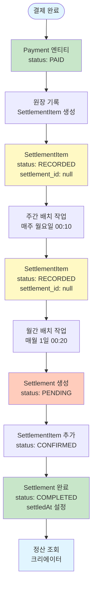
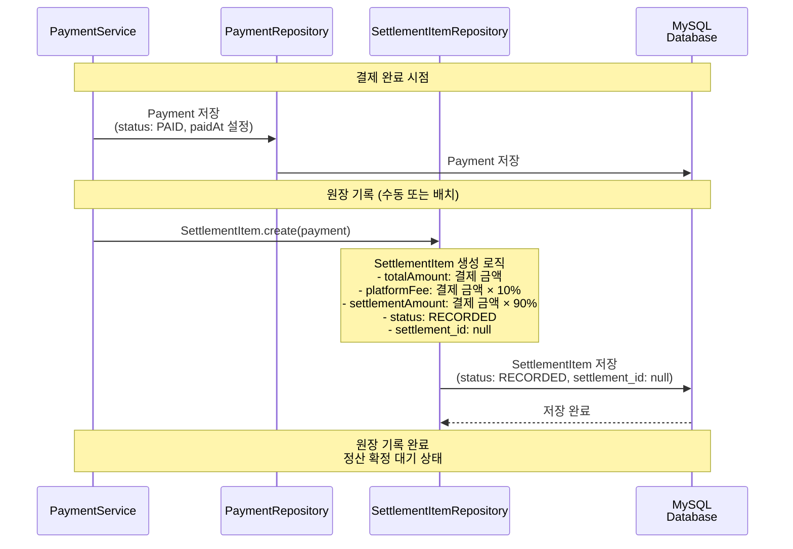
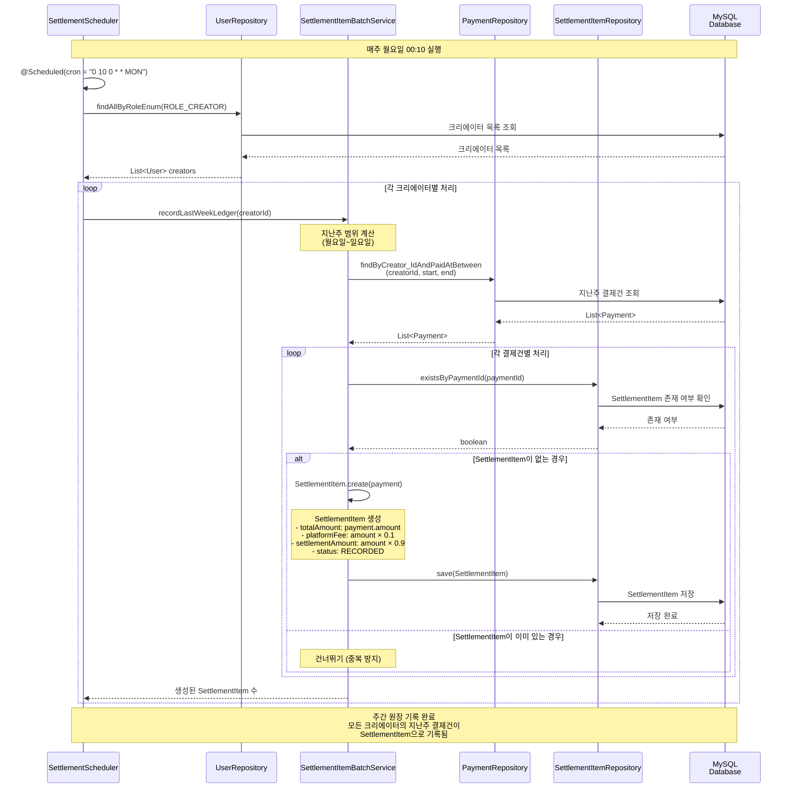
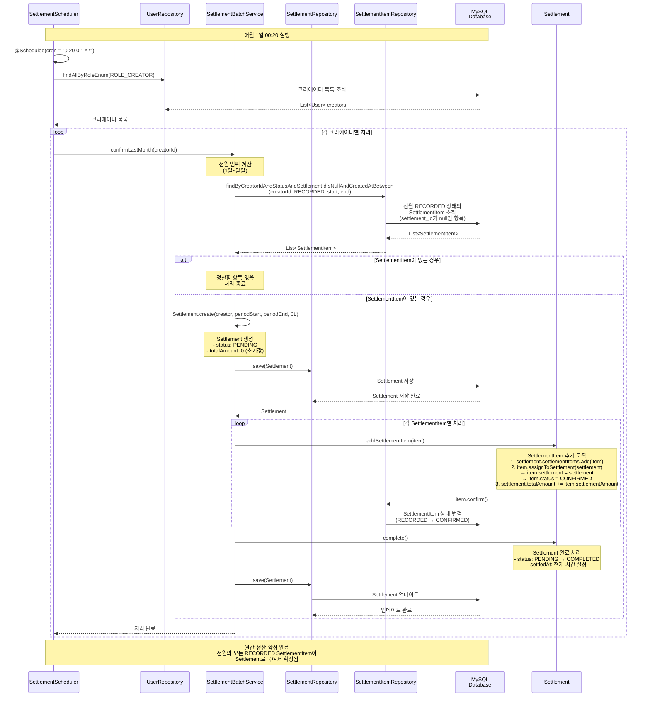
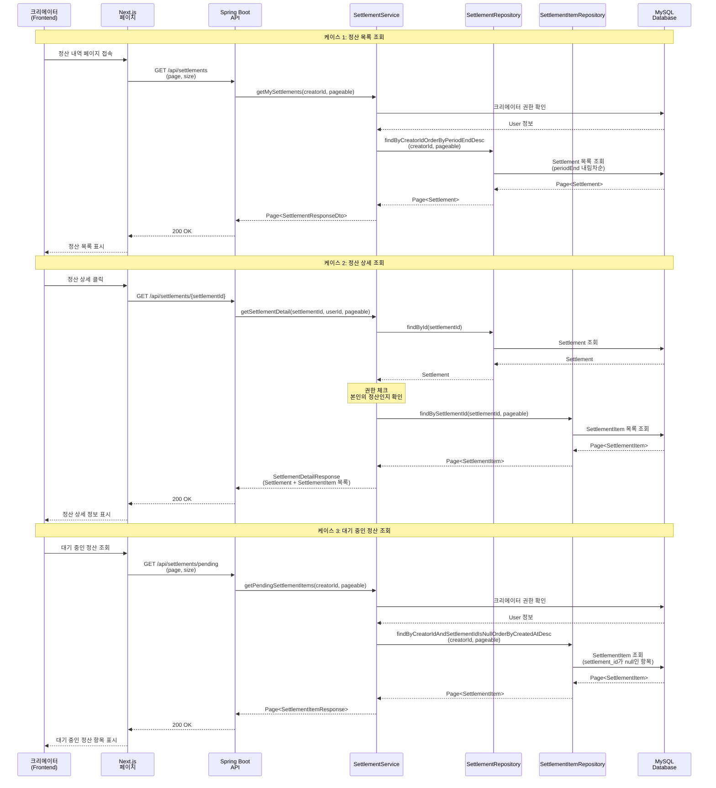
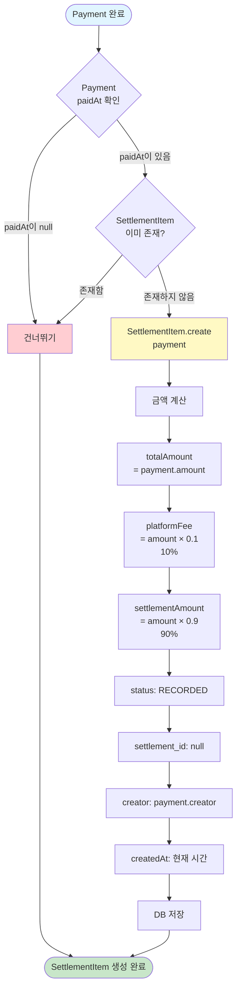
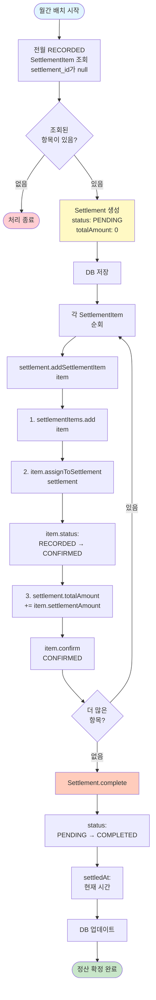
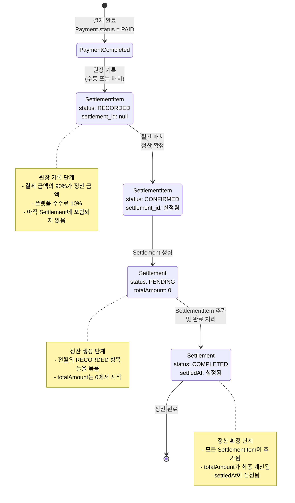
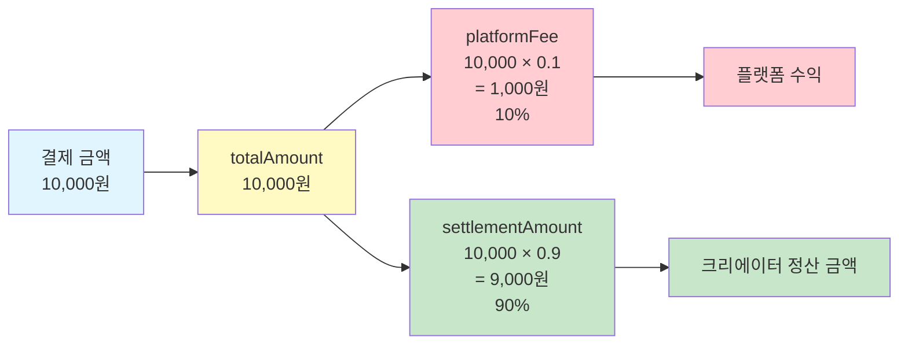

# 정산 플로우 문서

## 개요
이 문서는 SNS-Service의 크리에이터 정산 시스템의 전체 플로우를 설명합니다.
- **정산 원장 기록**: 결제 완료 후 정산 항목(SettlementItem) 생성
- **주간 원장 기록**: 매주 월요일 배치 작업으로 지난주 결제건 기록
- **월간 정산 확정**: 매월 1일 배치 작업으로 전월 정산 확정
- **정산 조회**: 크리에이터가 자신의 정산 내역 조회

---

## 정산 시스템 전체 플로우



---

## 결제 완료 후 원장 기록 플로우



---

## 주간 원장 기록 배치 작업 플로우



---

## 월간 정산 확정 배치 작업 플로우



---

## 정산 조회 플로우



---

## SettlementItem 생성 로직 상세



---

## Settlement 확정 로직 상세



---

## 정산 상태 전이도



---

## 데이터 모델 관계도

```mermaid
erDiagram
    USER ||--o{ SETTLEMENT : "크리에이터"
    USER ||--o{ SETTLEMENT_ITEM : "크리에이터"
    USER ||--o{ PAYMENT : "결제"
    
    PAYMENT ||--|| SETTLEMENT_ITEM : "1:1"
    SETTLEMENT ||--o{ SETTLEMENT_ITEM : "1:N"
    
    SETTLEMENT {
        bigint id PK
        bigint creator_id FK
        date period_start "정산 기간 시작"
        date period_end "정산 기간 종료"
        bigint total_amount "총 정산 금액"
        enum status "PENDING, COMPLETED, FAILED"
        datetime settled_at "정산 확정 시간"
    }
    
    SETTLEMENT_ITEM {
        bigint id PK
        bigint payment_id FK UK "결제 ID (1:1)"
        bigint settlement_id FK "정산 ID (null 가능)"
        bigint creator_id FK
        bigint total_amount "결제 금액"
        bigint platform_fee "플랫폼 수수료 (10%)"
        bigint settlement_amount "정산 금액 (90%)"
        enum status "RECORDED, CONFIRMED"
        datetime created_at "원장 기록 시간"
    }
    
    PAYMENT {
        bigint id PK
        string orderId
        string paymentKey
        bigint user_id FK
        bigint creator_id FK
        bigint amount "결제 금액"
        enum status "PAID, CANCELED"
        datetime paidAt "결제 완료 시간"
    }
    
    note right of SETTLEMENT
        월간 정산 단위
        - 전월 1일~말일 기준
        - 여러 SettlementItem을 묶음
        - totalAmount는 모든 settlementAmount의 합
    end note
    
    note right of SETTLEMENT_ITEM
        개별 정산 항목
        - Payment와 1:1 관계
        - settlement_id가 null이면 대기 중
        - RECORDED: 원장 기록됨
        - CONFIRMED: 정산 확정됨
    end note
    
    note right of PAYMENT
        결제 정보
        - 결제 완료 시 SettlementItem 생성
        - paidAt 기준으로 원장 기록
    end note
```

---

## 정산 금액 계산 로직



---

## 배치 작업 스케줄

```mermaid
gantt
    title 정산 배치 작업 스케줄
    dateFormat YYYY-MM-DD
    section 주간 원장 기록
    매주 월요일 00:10 실행    :2024-01-01, 7d
    section 월간 정산 확정
    매월 1일 00:20 실행       :2024-01-01, 1d
```

### 배치 작업 상세

#### 1. 주간 원장 기록 (Weekly Ledger Recording)
- **스케줄**: 매주 월요일 00:10
- **크론 표현식**: `0 10 0 * * MON`
- **작업 내용**:
  - 모든 크리에이터에 대해 지난주(월요일~일요일) 결제건 조회
  - SettlementItem이 없는 Payment에 대해 SettlementItem 생성
  - status: RECORDED, settlement_id: null

#### 2. 월간 정산 확정 (Monthly Settlement Confirmation)
- **스케줄**: 매월 1일 00:20
- **크론 표현식**: `0 20 0 1 * *`
- **작업 내용**:
  - 모든 크리에이터에 대해 전월(1일~말일) SettlementItem 조회
  - status가 RECORDED이고 settlement_id가 null인 항목만 대상
  - Settlement 생성 및 SettlementItem 연결
  - Settlement.status: COMPLETED, SettlementItem.status: CONFIRMED

---

## 주요 API 엔드포인트

### 정산 조회
- `GET /api/settlements` - 정산 목록 조회 (페이지네이션)
- `GET /api/settlements/{settlementId}` - 정산 상세 조회
- `GET /api/settlements/pending` - 대기 중인 정산 항목 조회

### 요청/응답 예시

#### 정산 목록 조회
```json
GET /api/settlements?page=0&size=10

Response:
{
  "content": [
    {
      "id": 1,
      "periodStart": "2024-01-01",
      "periodEnd": "2024-01-31",
      "totalAmount": 900000,
      "status": "COMPLETED",
      "settledAt": "2024-02-01T00:20:00",
      "creatorNickname": "creator1"
    }
  ],
  "totalElements": 5,
  "totalPages": 1
}
```

#### 정산 상세 조회
```json
GET /api/settlements/1?page=0&size=10

Response:
{
  "id": 1,
  "periodStart": "2024-01-01",
  "periodEnd": "2024-01-31",
  "totalAmount": 900000,
  "status": "COMPLETED",
  "settledAt": "2024-02-01T00:20:00",
  "items": {
    "content": [
      {
        "id": 1,
        "paymentId": 10,
        "totalAmount": 10000,
        "platformFee": 1000,
        "settlementAmount": 9000,
        "status": "CONFIRMED",
        "createdAt": "2024-01-15T10:30:00"
      }
    ]
  }
}
```

#### 대기 중인 정산 조회
```json
GET /api/settlements/pending?page=0&size=10

Response:
{
  "content": [
    {
      "id": 20,
      "paymentId": 25,
      "totalAmount": 10000,
      "platformFee": 1000,
      "settlementAmount": 9000,
      "status": "RECORDED",
      "createdAt": "2024-02-05T14:20:00"
    }
  ]
}
```

---

## 주요 비즈니스 로직

### 1. SettlementItem 생성 규칙
- Payment가 완료(PAID)된 경우에만 생성
- 한 Payment당 하나의 SettlementItem만 존재 (중복 방지)
- 플랫폼 수수료: 결제 금액의 10%
- 정산 금액: 결제 금액의 90%
- 초기 상태: RECORDED, settlement_id: null

### 2. 주간 원장 기록 규칙
- 지난주(월요일~일요일) 범위의 결제건만 대상
- 이미 SettlementItem이 존재하는 Payment는 건너뛰기
- 배치 작업은 모든 크리에이터에 대해 순차 실행

### 3. 월간 정산 확정 규칙
- 전월(1일~말일) 범위의 SettlementItem만 대상
- status가 RECORDED이고 settlement_id가 null인 항목만 포함
- Settlement의 totalAmount는 모든 settlementAmount의 합
- SettlementItem 추가 시 자동으로 status가 CONFIRMED로 변경

### 4. 정산 조회 권한
- 크리에이터(ROLE_CREATOR)만 조회 가능
- 본인의 정산만 조회 가능 (권한 체크)
- 대기 중인 정산은 settlement_id가 null인 항목만 조회

---

## 에러 처리

### 정산 관련 에러
- `SETTLEMENT_NOT_FOUND`: 정산을 찾을 수 없음
- `SETTLEMENT_FORBIDDEN`: 본인의 정산이 아님 (권한 없음)
- `CREATOR_FORBIDDEN`: 크리에이터 권한이 없음

### 배치 작업 에러 처리
- 각 크리에이터별로 독립적으로 처리
- 한 크리에이터의 처리 실패가 다른 크리에이터에 영향 없음
- 에러 발생 시 로그 기록 후 다음 크리에이터 처리 계속

---

## 정산 플로우 타임라인

```mermaid
timeline
    title 정산 플로우 타임라인 예시 (2024년 1월)
    
    section 1월
        1월 1일~31일 : 결제 발생
                        Payment 생성
                        SettlementItem 생성 (RECORDED)
    
    section 2월
        2월 1일 00:20 : 월간 배치 실행
                        전월 SettlementItem 조회
                        Settlement 생성 (PENDING)
                        SettlementItem 연결 (CONFIRMED)
                        Settlement 완료 (COMPLETED)
    
    section 이후
        크리에이터 : 정산 내역 조회 가능
                    정산 상세 확인 가능
```

---

## 정산 금액 계산 예시

### 시나리오: 1월에 10건의 결제 발생

| 결제 금액 | 플랫폼 수수료 (10%) | 정산 금액 (90%) |
|----------|-------------------|----------------|
| 10,000원 | 1,000원 | 9,000원 |
| 20,000원 | 2,000원 | 18,000원 |
| 15,000원 | 1,500원 | 13,500원 |
| ... | ... | ... |
| **총 100,000원** | **10,000원** | **90,000원** |

### 2월 1일 정산 확정 시
- **Settlement.totalAmount**: 90,000원
- **SettlementItem 개수**: 10개
- **모든 SettlementItem.status**: CONFIRMED
- **Settlement.status**: COMPLETED


