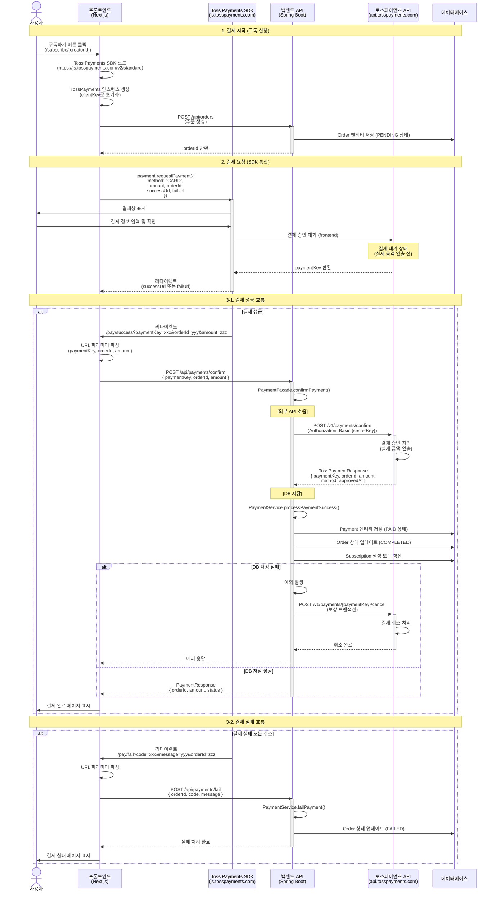

# 토스페이먼츠 외부 API 호출 아키텍처

## 개요
이 문서는 SubMeNote 프로젝트에서 토스페이먼츠 외부 API를 통합하는 아키텍처를 설명합니다.

## 아키텍처 다이어그램

## 시스템 구성 요소

### 1. 프론트엔드 (Next.js)

#### 주요 컴포넌트
- **`/app/subscribe/[creatorId]/page.tsx`**: 구독/결제 시작 페이지
  - Toss Payments SDK 로드 및 초기화
  - 주문 생성 API 호출
  - SDK를 통한 결제 요청

- **`/app/pay/success/page.tsx`**: 결제 성공 페이지
  - URL 파라미터에서 결제 정보 추출
  - 백엔드 결제 승인 API 호출

- **`/app/pay/fail/page.tsx`**: 결제 실패 페이지
  - 실패 정보를 백엔드에 전달

#### API 클라이언트
- **`src/api/orderApi.ts`**: 주문 생성 API
  - `createOrder()`: 주문 생성 요청

- **`src/api/paymentApi.ts`**: 결제 처리 API
  - `confirmPayment()`: 결제 승인 요청
  - `failPayment()`: 결제 실패 처리

### 2. 백엔드 (Spring Boot)

#### 컨트롤러 계층
- **`TossPaymentController`** (`/api/payments`)
  - `POST /confirm`: 결제 승인 처리
  - `POST /fail`: 결제 실패 처리

#### 서비스 계층
- **`PaymentFacade`**: 결제 프로세스 오케스트레이션
  - 외부 API 호출과 DB 처리를 조율
  - 보상 트랜잭션 처리 (DB 저장 실패 시 결제 취소)

- **`PaymentService`**: 결제 비즈니스 로직
  - 결제 정보 검증
  - Payment 엔티티 저장
  - Order 상태 업데이트
  - Subscription 생성/갱신

- **`TossPaymentsClient`**: 토스페이먼츠 외부 API 클라이언트
  - `confirm()`: 결제 승인 요청
  - `cancel()`: 결제 취소 요청
  - Basic Authentication (SecretKey 인코딩)

#### 데이터 모델
- **`Order`**: 주문 엔티티 (PENDING → COMPLETED/FAILED)
- **`Payment`**: 결제 엔티티 (PAID 상태, paymentKey 저장)
- **`Subscription`**: 구독 엔티티

### 3. 외부 서비스

#### Toss Payments SDK
- **URL**: `https://js.tosspayments.com/v2/standard`
- **역할**: 프론트엔드에서 결제창 제공 및 사용자 결제 처리
- **인증**: ClientKey (공개 키)

#### Toss Payments API
- **Base URL**: `https://api.tosspayments.com/v1`
- **주요 엔드포인트**:
  - `POST /payments/confirm`: 결제 승인 (실제 금액 인출)
  - `POST /payments/{paymentKey}/cancel`: 결제 취소
- **인증**: Basic Authentication (SecretKey 인코딩)
- **SecretKey**: 백엔드 환경변수에서 관리

## 결제 흐름 상세

### 단계별 설명

#### 1단계: 결제 시작
1. 사용자가 구독하기 버튼 클릭
2. 프론트엔드가 Toss Payments SDK 로드 (Script 태그)
3. SDK 초기화 (ClientKey로 인스턴스 생성)

#### 2단계: 주문 생성
1. 프론트엔드가 백엔드에 주문 생성 API 호출
2. 백엔드가 Order 엔티티를 PENDING 상태로 저장
3. orderId를 프론트엔드에 반환

#### 3단계: 결제 요청 (SDK)
1. 프론트엔드가 SDK의 `requestPayment()` 메서드 호출
2. SDK가 결제창을 표시
3. 사용자가 결제 정보 입력 및 확인
4. SDK가 토스페이먼츠 서버와 통신하여 결제 대기 상태 생성
5. 성공/실패에 따라 지정된 URL로 리다이렉트

#### 4단계: 결제 승인 (백엔드)
1. 결제 성공 시 프론트엔드가 `/pay/success`로 리다이렉트
2. URL 파라미터에서 `paymentKey`, `orderId`, `amount` 추출
3. 백엔드 결제 승인 API 호출
4. 백엔드가 토스페이먼츠 외부 API에 결제 승인 요청
5. 토스페이먼츠가 실제 금액을 인출
6. 백엔드가 Payment 엔티티 저장 및 Order 상태 업데이트
7. DB 저장 실패 시 보상 트랜잭션으로 결제 취소

## 보안 및 에러 처리

### 인증 방식
- **프론트엔드 → Toss SDK**: ClientKey (공개 키)
- **백엔드 → Toss API**: SecretKey (비밀 키, Basic Auth)

### 보상 트랜잭션
- **시나리오**: DB 저장 실패 시 이미 승인된 결제를 취소
- **구현**: `PaymentFacade`에서 try-catch로 예외 처리 후 `cancel()` 호출
- **주의사항**: 취소 API 호출도 실패할 수 있으므로 로깅 필수

### 에러 처리
- **4xx 에러**: 잘못된 요청 (이미 승인됨, 잔액 부족 등)
- **5xx 에러**: 토스 서버 장애
- **네트워크 에러**: 재시도 로직 없음 (사용자에게 에러 표시)

## 환경 변수

### 프론트엔드
- `NEXT_PUBLIC_TOSS_CLIENT_KEY`: Toss Payments ClientKey (공개 키)
- `NEXT_PUBLIC_TOSS_REDIRECT_MODE`: 리다이렉트 모드 (frontend/backend)

### 백엔드
- `toss.payments.secret-key`: Toss Payments SecretKey (비밀 키)

## 특징

### 1. 분리된 책임
- **프론트엔드**: 사용자 인터페이스 및 SDK 통신
- **백엔드**: 외부 API 호출 및 데이터 영속성
- **외부 API**: 실제 결제 처리

### 2. 안전한 결제 승인
- 실제 금액 인출은 백엔드에서만 수행 (SecretKey 보호)
- 프론트엔드에서 직접 결제 승인 불가

### 3. 보상 트랜잭션
- DB 저장 실패 시 자동으로 결제 취소
- 일관성 보장 (Saga 패턴 적용)

### 4. 상태 관리
- Order: PENDING → COMPLETED/FAILED
- Payment: PAID (결제 승인 후 생성)

